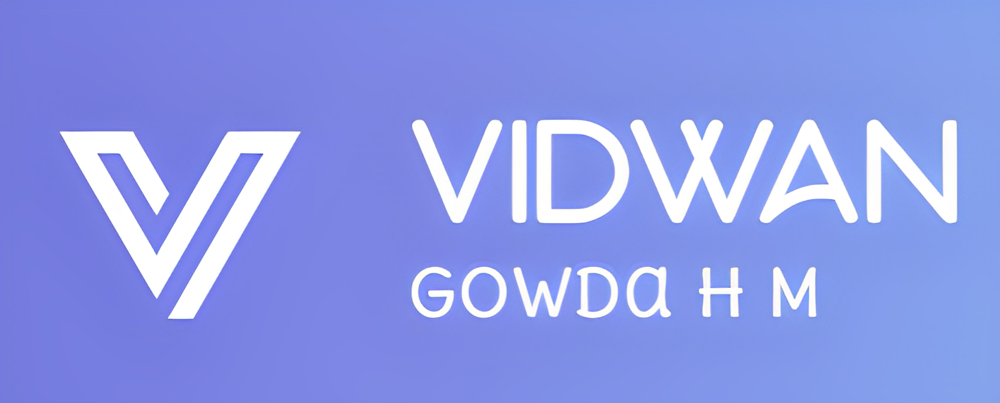

<h1 align="center">Hi 👋, I'm Vidwan Gowda H M</h1>
<h3 align="center">Passionate Explorer, Innovative Learner, Collaborative Builder</h3>

  

  

- 🌱 I’m currently learning **Data Science and Machine Learning**

- 📫 How to reach me **gowdavidwan2003@gmail.com**

<h3 align="left">Connect with me:</h3>

<h3 align="left">Languages and Tools:</h3>

             

&nbsp;

